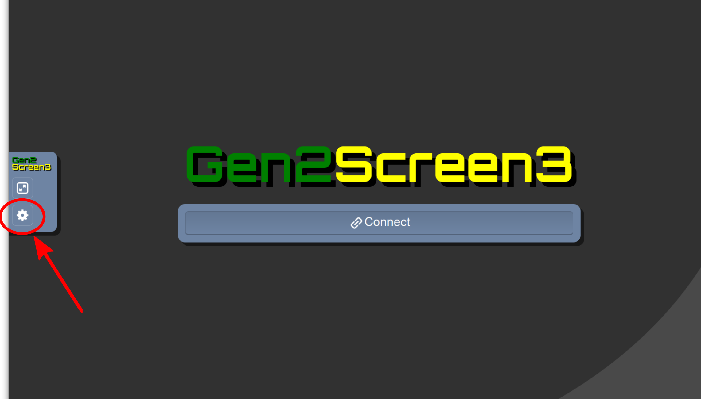

# Instructions for Use

This assumes that you have already installed the g2remote package with
all requirements as outlined in the file [install.md](https://github.com/naojsoft/g2remote/blob/master/doc/install.md).

## One-time setup instructions

1). Generate an ssh-key with

```bash
$ ssh-keygen -b 4096 -f gen2_connect
```

IMPORTANT: *do not add a passphrase* (press Return or Enter when prompted);
the program will not work with a key that has a passphrase.
      
(or using the key generation program supplied with your ssh client).
This should generate *two* (2) files: `gen2_connect` and `gen2_connect.pub`. 
We strongly recommend that you put the two files generated by the keygen
in a new empty folder.  You will be able to use these keys for future
remote observations with Subaru Telescope, so please save them.
    
Upload your .pub key file to the [GERS User Self Service site](https://hscq.naoj.hawaii.edu/guser/login). 

2). From the Subaru GERS Self Service site, download the zipped set of
config files for your observations (there is a button to do this).
It is recommended to unzip these into in the same folder where you stored
your keys, as that is how the config file is set up to be used by default.

(If you have stored items in a different way you may need to edit your
YAML configuration file.  If so, examine the config file, and make
sure that the paths referring to files in the zip bundle are correct)  
      
If any of these are incorrect, or you are instructed to modify them,
correct them using a text editor.

NOTE: *GERS config files are updated every semester for security reasons*.
Use the GERS self service web site to download the config files for the
current semester if yours are out of date.

## Per-observation setup instructions

3). Start a command shell with the Python environment where you installed
    `g2remote`.

If you are using Windows and have installed Anaconda or Miniconda
for your Python environment, your Start menu should have an
"Anaconda Prompt" item in the Anaconda3 folder. Use the "Anaconda Prompt"
to run up your Windows command shell.

4). In the shell, "cd" into the folder where you stored your keys and the
unzipped config files.  Then, run 

```bash
$ g2connect -f <YAML config file>
```

For Windows OS users, run the following command in your "Anaconda Prompt" shell:

```bash
$ g2connect <YAML config file>
```

You should be prompted with a `g2connect>` command loop.

5). Run the command "c" to connect.  If successful, it should just return
    to the command prompt after printing a message with a URL.

```bash
g2connect> c
connecting ...
Visit http://localhost:8500/ to view screens via web browser.

g2connect> 
```

For Windows OS users, your first connection attempt will likely result in a
popup dialog box from Windows Defender Firewall with a message prompting you
to "Allow Python to communicate on these networks:". Make sure that the
"Private networks" box is checked and then click on "Allow access".
After that, the connection should proceed normally.

6). Open the URL (that is shown in the message after connecting) in a web
    browser.  Supported browsers include Chrome, Firefox, Safari and Edge
    (others may also work).  You will see a list of links to Gen2 screens.
    Open each screen that you are interested in viewing in a separate
    browser tab.  In each tab, click the "Connect" button to view that
    screen.\
    \
    You can drag tabs out onto your desktop as needed to view multiple
    screens at the same time.  See the explanation below (under "Screens")
    for a description of the screens.  The screen may be larger than the
    browser window by default, but can be scaled to the browser size using
    the instructions below under "Notes".
    
7). When you are ready to terminate the observation, close the browser tabs
    containing Gen2 screens and then type the "q" command in the g2connect
    program.

## Notes

* Normally it is not necessary to view all of the Gen2 screens.  See the
  explanation below (under "Screens") for a description of the screens.
  You can ask your Support Astronomer or Operator which screens are most
  useful for your observation.  You can reduce the network bandwidth needed
  by closing screens you do not need to monitor.
  
* You can drag browser tabs out onto your desktop as needed to view multiple
  screens at the same time. 

* The screen may be larger than the browser window by default, but can be
  scaled to the browser size.  To do this, click the small "arrow" icon at
  the left-side (middle) edge of the screen:

  
  
  It should expand into a configuration dialog where you can select
  "Local Scaling" under "Scaling Mode:":

  

  This will scale the window contents to your browser window size.

## Screens

| Screen | Content |
| ------ | ------- |
| 1      | SPOT, hskymon (observation planning tools) |
| 2      | instrument control GUIs |
| 3      | integgui2 (observation execution tool) |
| 4      | fitsview (QDAS, quick look, slit alignment, etc), HSC obslog |
| 5      | guideview, lgs_gui2 (guiding/AO control and monitoring) |
| 6      | statmon (current telescope status) |
| 7      | instrument control and weather monitoring GUIs |
| 8      | instrument control and weather monitoring GUIs |

Note that each screen is a 2550x1380 VNC window, so you will be managing a
lot of large screens. Probably you are not interested in all screens.
Consult your Support Astronomer to decide which ones are important for
your observation.

