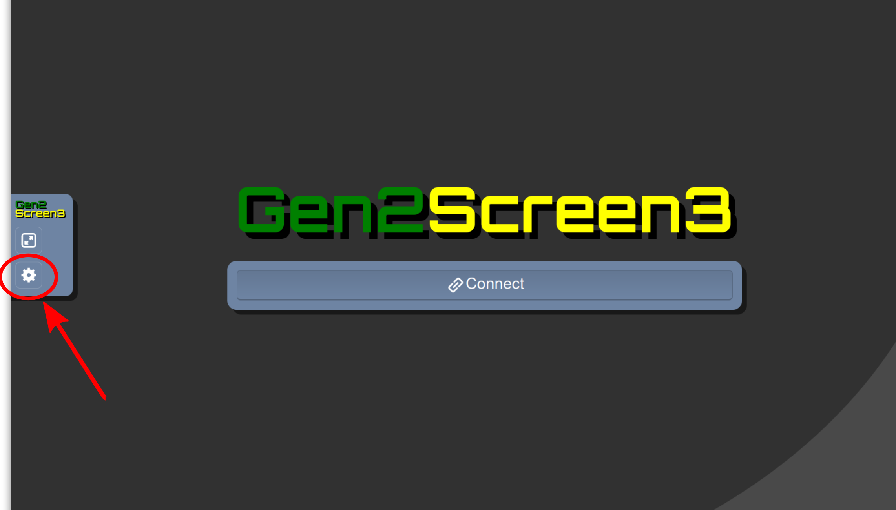
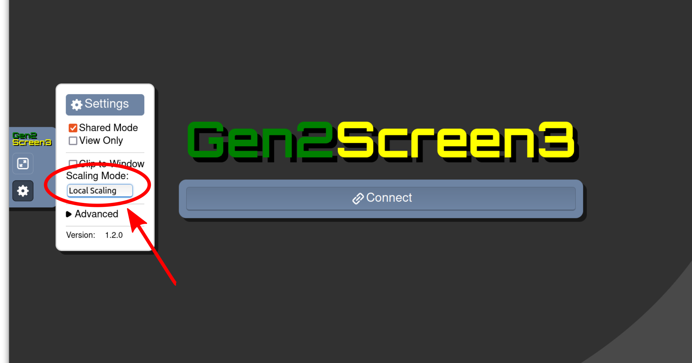

# 使用方法

ここでは、g2remoteパッケージはすでにお使いの環境下でインストールされているとします。インストールについてはこちら[install_jp.md](https://github.com/naojsoft/g2remote/blob/master/doc/install_jp.md )をご確認ください。

## 初回利用時のみ

1). SSH鍵を作成します。

```bash
$ ssh-keygen -b 4096 -f gen2_connect
```

重要：**パスフレーズは設定しないでください。** パスフレーズを設定するとプログラムが正しく動作しません。

上記の操作で、`gen2_connect`(秘密鍵)と`gen2_connect.pub`(公開鍵)の2つのファイルが生成されます。２つのファイルを新しく作成したフォルダーに保存する事を勧めます。今後のスバルリモート観測に使用する事になるので、大切にファイルを保管してください。

あたなたの.pubキーファイルを[GERS User Self Service site](https://hscq.naoj.hawaii.edu/guser/login)にてアップロードしてください。 


2). GERS User Self Service siteより、ジップファイルをダウンロードしてください（ダウンロードボタンがあります）。
ダウンロードしたジップファイルを解凍し、キーファイルを保存したフォルダーと同じフォルダーに保存することをお勧めします。ファイルが同じフォルダーにあることがディフォルト設定となっています。

それぞれのファイルが異なる場所に保存されている場合は、YAML設定ファイルを編集してください。設定ファイル内のファイルパスを確認してください。

値が違っている場合、また変更するよう指示のあった場合には、設定ファイルをテキストエディタ等で開いて修正してください。

注意事項：*GERS 設定ファイルは、セキュリティーの理由で、セメスター毎に更新されます*。
設定ファイルが期限切れの場合は、GERS self service web siteを利用し、現在のセメスター設定ファイルをダウンロードしてください。　


## 観測の準備

3). `g2remote`をインストールしたPython環境でコマンドシェルを起動してください。

Windowsをお使いで、Python環境としてAnacondaもしくはMinicondaをインストールしている場合、スタートメニューのAnaconda3フォルダに"Anaconda Prompt"があります。この"Anaconda Prompt"をコマンドシェルとしてお使いください。

4). シェル内で、キー、設定ファイルを保存したフォルダーに移動し、以下のコマンドを実行してください。

```bash
$g2connect -f <YAML config file>
```
Windowsをお使いの場合は、"Anaconda Prompt"シェル内で、以下のコマンドを実行してください。

```bash
$ g2connect <YAML config file>
```

`g2connect>`プロンプトが表示されます。

5). 以下のように、"c"コマンドを実行して接続してください。接続に成功すると、コマンドプロンプトに戻ります。

```bash
g2connect> c
connecting ...
Visit http://localhost:8500/ to view screens via web browser.

g2connect> 
```

Windowsをお使いの場合、最初に接続しようとする際に、"Pythonにこれらのネットワークへの接続を許可する:"というWindows Defenderファイヤーウォールからの警告が表示されます。"プライベートネットワーク"にチェックが入っていることを確認して、アクセスを許可するボタンをクリックして下さい。その後は、正常に接続されるはずです。

6). 接続時に表示されたURLをブラウザで開きます。サポートがされているブラウザは、Firefox,Chrome,SafarとEdgeです。gen2スクリーンへのリンクリストがあります。ブラウザタブで必要なスクリーンを開いてください。"Connect"ボタンでgen2スクリーンに接続します。

複数のgen2スクリーンを同時に見る場合は、各タブをデスクトップ上にドラッグしてください。各スクリーンの説明は、下の"スクリーン"をご覧ください。デフォルトのスクリーンサイズは、ブラウザのウィンドウサイズより大きいかもしれませんが、ブラウザサイズの変更が出来ます。下の注意事項をご覧ください。

7). 観測終了時には、gen2に接続されているブラウザを閉じて、コマンドプロンプトで"q"を押してください。


## 注意事項

* 通常は全てのgen2スクリーンに接続する必要はありません。各スクリーンの説明は、下の"スクリーン"をご覧ください。どのスクリーンが観測に必要かはサポートサイエンティスト又は、オペレーターにお尋ねください。モニターが必要でないスクリーンの接続を切る事で、ネットワークの負荷を軽減出来ます。

* 各タブをデスクトップ上にドラッグすることで、複数のgen2スクリーンを同時に見る事が出来ます。

* デフォルトのスクリーンサイズは、ブラウザのウィンドウサイズより大きいかもしれませんが、ブラウザサイズの変更が出来ます。変更をするには、左側中央にある小さな"アロー"アイコンをクリックしてください。

  

  ギアーアイコンで設定ボックスを開き、 "Scaling Mode:"下の"Local Scaling"を選択出来ます。

  

　ウィンドウの内容が、ブラウザウィンドウのサイズに合わせて縮小、拡大されます。　


## スクリーン

| Screen | Content |
| ------ | ------- |
| 1      | hskymon (observation planning tool) |
| 2      | instrument control GUIs |
| 3      | integgui2 (observation execution tool) |
| 4      | fitsview (QDAS, quick look, slit alignment, etc), HSC obslog |
| 5      | guideview (guiding control and monitoring) |
| 6      | statmon (current telescope status) |
| 7      | instrument control and monitoring GUIs |
| 8      | instrument control and monitoring GUIs |

各スクリーンは2550x1380のVNCウィンドウです。リモート観測時に必ずしも全てのスクリーンを確認する必要はないかもしれません。当該観測でどのスクリーンが重要であるか、担当のサポートアストロノマーにご相談ください。
